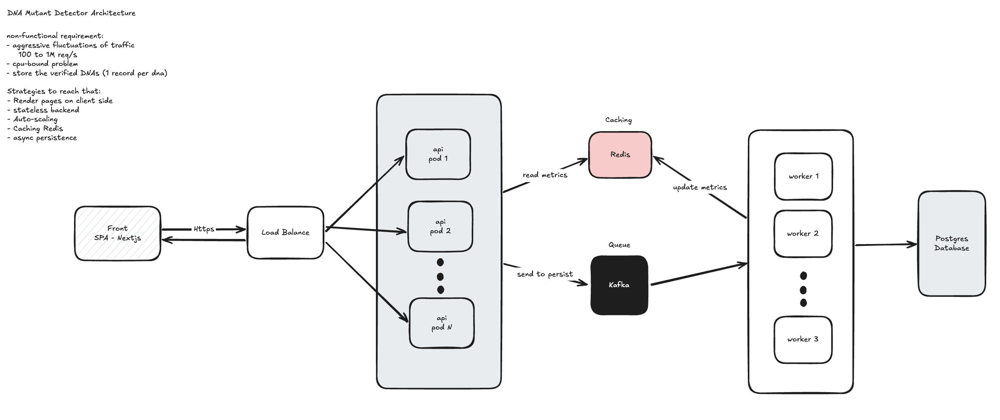

# DNA Mutant Detector

## Solution Architecture


## Prerequisites
- Docker and Docker Compose

## Run all projects with Docker Compose

From the project root:

```bash
docker compose up -d
```

This starts:

| Service    | URL                    | Description        |
|-----------|------------------------|--------------------|
| Frontend  | http://localhost:3000  | Next.js app        |
| Backend   | http://localhost:8080  | Quarkus API        |
| Grafana   | http://localhost:3001  | Dashboards & visualization |
| Prometheus| http://localhost:9090  | Metrics            |
| Database  | localhost:5432         | PostgreSQL (magneto)|
| Kafka     | http://localhost:29092 | Event Streaming    |
| Kafdrop   | http://localhost:9000  | Kafka UI           |
| Redis     | http://localhost:6379  | Cache              |

To run in the foreground (logs in the terminal):

```bash
docker compose up
```

To stop and remove containers:

```bash
docker compose down
```

To rebuild images after code changes:

```bash
docker compose up -d --build
```

## Load Tests with k6

Load tests are located in `dna-mutant-detector/k6/scenarios/`.

### Run with Docker Compose

Make sure the backend is running first:

```bash
docker compose up -d
```

Then run the load test using the `loadtest` profile:

```bash
docker compose --profile loadtest run --rm k6 run /dna-mutant-detector/k6/scenarios/spike.js
```

### Run with k6 CLI

First, ensure the backend is running and accessible at `http://localhost:8080`.

Install k6 (if not already installed):

- macOS: `brew install k6`
- Linux: See [k6 installation guide](https://grafana.com/docs/k6/latest/set-up/install-k6/)

Run the load test:

```bash
k6 run ./dna-mutant-detector/k6/scenarios/spike.js
```

To use a different API URL:

```bash
k6 run -e API_URL=http://localhost:8080 ./dna-mutant-detector/k6/scenarios/spike.js
```

## Visualize with Grafana

Grafana runs when you start the stack with Docker Compose and is available at **http://localhost:3001**.

1. **Start the stack** (if not already running):

   ```bash
   docker compose up -d
   ```

2. **Open Grafana** in your browser: [http://localhost:3001](http://localhost:3001).

3. **Log in** with the default credentials:
   - **Username:** `admin`
   - **Password:** `admin`  
   You will be prompted to change the password on first login.

4. **Add data sources** (optional): Prometheus (http://prometheus:9090) and Tempo are available as services in the same Docker network. In Grafana, go to **Connections → Data sources** to add them and build dashboards for metrics and traces.

## KAFKA 
Kafka runs when start the stack using docker compose

Kafka UI (Kafdrop): open http://localhost:9000 in your browser

```bash
# To produce messages
# Connect to kafka container
docker compose exec -it kafka bash

# Produce message
kafka-console-producer \
  --bootstrap-server kafka:9092 \
  --topic async-persist.dna
# write here each message
> {"dna-hash":"hash123123","isMutant":true}
> {"dna-hash":"hash456","isMutant":false}
# cmd+c or ctrl+c to exit
```
