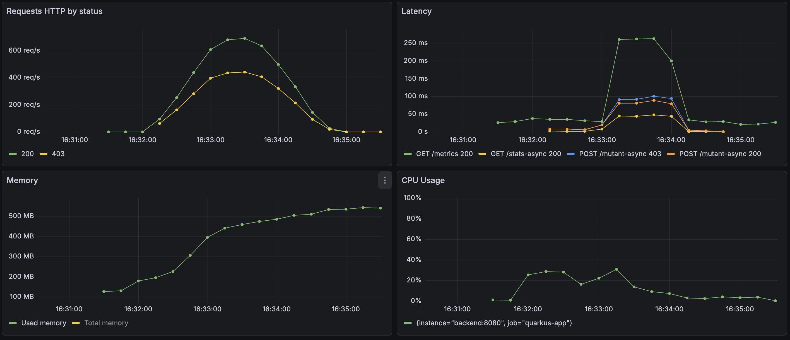

## Chosen Language
I chose Java because it can give me the performance and scalability that I need for this project. Also, Java is a mature, robust, well structure, high tested and high adopted language.

## Test Coverage Report
I configured test coverage report libs for each project (backend JaCoCo, front Jest).
They run automatically when open a PR or after any push in the main branch. 
### Where do I find the report?
It can be downloaded on the action's coverage page, after a successful pipeline execution


## Observability
I configured Protheus+Grafana for monitoring container metrics like cpu usage, memory usage, RPS, latency, etc. I also configured quarkus telemetry with Grafana Tempo to help me analyse end-to-end request traces, database query performance, to find the bottlenecks.

## Load tests
Before starts tunning the application performance, I created load tests scenarios using k6 to mesure the current application's performance. I expected to find insights of where should I improve the performe and compare the modifications

### Tests actual design system


I writed a load test scenario using k6 using ramping-arrival-rate strategy.
- start at 100 interations/s
- ramp up from 100 interations/s to 600 interations/s in 30s
- keep 600 interations/s for 1min
- ramp down to 100 interations/s in 30s

Each interation we send 1 random dna 6x6 to /mutant and request the /stats

*OBS: It was not possible to reach 1,000,000 req/s locally. K6 tried to scale until the limit of the machine. I kept a smaller rate for compare the architecures locally

TOTAL RESULTS 

    checks_total.......: 79246  583.771857/s
    checks_succeeded...: 99.94% 79199 out of 79246
    checks_failed......: 0.05%  47 out of 79246

    ✗ status is 200 or 403
      ↳  99% — ✓ 39582 / ✗ 41
    ✗ status is 200
      ↳  99% — ✓ 39617 / ✗ 6

    HTTP
    http_req_duration..............: avg=2.05s min=431.04µs med=95.87ms  max=23.74s p(90)=5.62s p(95)=9.02s 
      { expected_response:true }...: avg=1.95s min=431.04µs med=71.42ms  max=19.63s p(90)=5.39s p(95)=8.21s 
    http_req_failed................: 39.20% 31072 out of 79246
    http_reqs......................: 79246  583.771857/s

    EXECUTION
    dropped_iterations.............: 17335  127.699633/s
    iteration_duration.............: avg=4.17s min=1.27ms   med=277.19ms max=27.49s p(90)=13.8s p(95)=21.47s
    iterations.....................: 39623  291.885928/s
    vus............................: 324    min=0              max=2663
    vus_max........................: 2664   min=1000           max=2664

    NETWORK
    data_received..................: 7.5 MB 56 kB/s
    data_sent......................: 10 MB  77 kB/s


#### Anlyses
Firstly, I checked the traces of the requests where the db response time was higher than 500ms.

From the results, I could realize that the application spent most part of the time handling the request (3.15s) and awaiting for the database connection (3.97s).
The trace does not specify if the time processing the request was spent handling the HTTP I/O, or doing some processing like hashing and analysing the dna. I suppose it was spent handling the HTTP I/O.

Solutions:
- For the time handling the requests, I believe that doing some horizontal autoscaling could solve the problem. The backend is stateless, so we would not have problem with different data between replicas.


- For the awaiting database connection, increase connection pool wont works forever. I would implement the async persistence to persist the dna hash on database.


### Tests async design system


I used the same load test scenario from the test before.
- start at 100 interations/s
- ramp up from 100 interations/s to 600 interations/s in 30s
- keep 600 interations/s for 1min
- ramp down to 100 interations/s in 30s

 TOTAL RESULTS 

    checks_total.......: 110264  918.747582/s
    checks_succeeded...: 100.00% 110264 out of 110264
    checks_failed......: 0.00%   0 out of 110264

    ✓ status is 200 or 403
    ✓ status is 200

    HTTP
    http_req_duration..............: avg=61.61ms  min=72.16µs  med=714.37µs max=4.53s p(90)=39.83ms  p(95)=302.53ms
      { expected_response:true }...: avg=44.17ms  min=72.16µs  med=554.39µs max=4.43s p(90)=23.28ms  p(95)=212.78ms
    http_req_failed................: 39.11% 43134 out of 110264
    http_reqs......................: 110264 918.747582/s

    EXECUTION
    dropped_iterations.............: 1864   15.53132/s
    iteration_duration.............: avg=127.54ms min=400.41µs med=2.13ms   max=5.66s p(90)=119.27ms p(95)=911.56ms
    iterations.....................: 55132  459.373791/s
    vus............................: 0      min=0               max=1144
    vus_max........................: 1195   min=1000            max=1195

    NETWORK
    data_received..................: 6.4 MB 53 kB/s
    data_sent......................: 15 MB  126 kB/s




#### Anlyses
As we can see on the k6 reports, we were able to process 110264 requests in 2 min (918 req/s), an improvement of 39,14% comparing with the last test. We also have an improvement of 96,9% in the avg latency, reducing from 2.05s to 61.61ms.

```
# first test
http_req_duration..............: avg=2.05s min=431.04µs med=95.87ms  max=23.74s p(90)=5.62s p(95)=9.02s
http_reqs......................: 79246  583.771857/s

# second test
http_req_duration..............: avg=61.61ms  min=72.16µs  med=714.37µs max=4.53s p(90)=39.83ms  p(95)=302.53ms
http_reqs......................: 110264 918.747582/s

```