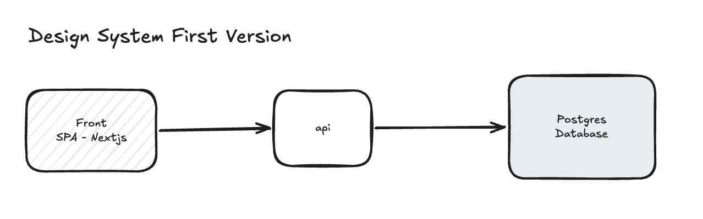
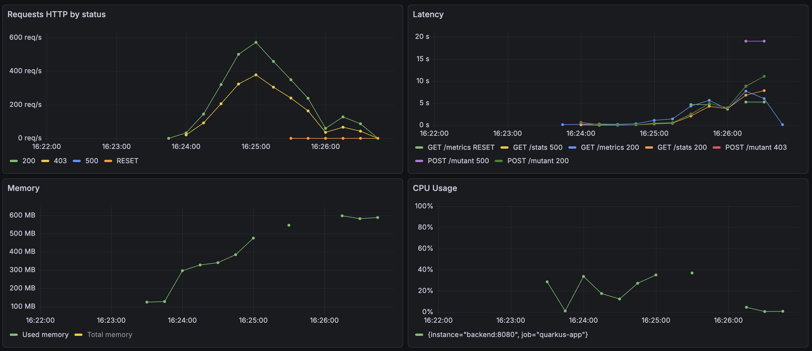
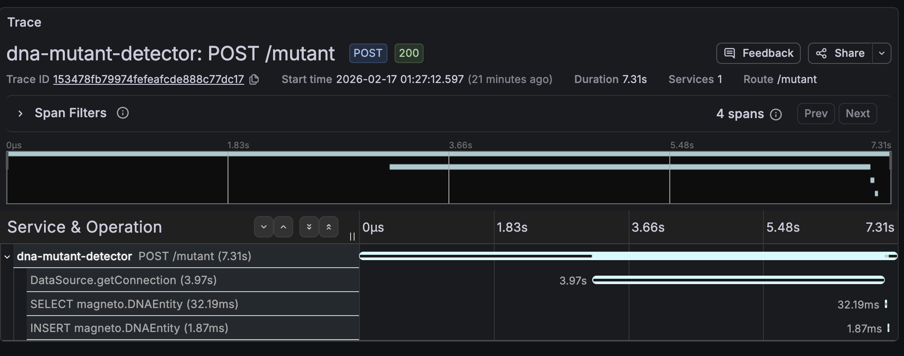
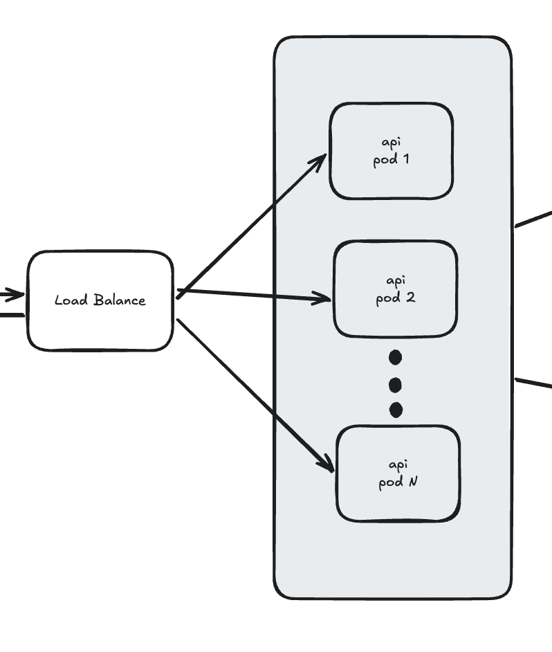
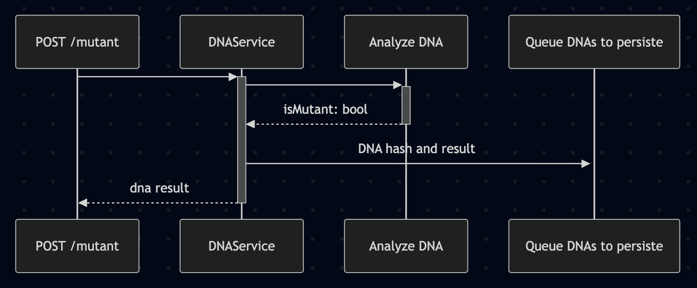

## Chosen Language
I chose Java because it can give me the performance and scalability that I need for this project. Also, Java is a mature, robust, well structure, high tested and high adopted language.

## Test Coverage Report
I configured test coverage report libs for each project (backend JaCoCo, front Jest).
They run automatically when open a PR or after any push in the main branch. 
### Where do I find the report?
It can be downloaded on the action's coverage page, after a successful pipeline execution

## Observability
I configured Protheus+Grafana for monitoring container metrics like cpu usage, memory usage, RPS, latency, etc. I also configured quarkus telemetry with Grafana Tempo to help me analyse end-to-end request traces, database query performance, to find the bottlenecks.

## Load tests
Before starts tunning the application performance, I created load tests scenarios using k6 to mesure the current application's performance. I expected to find insights of where should I improve the performe and compare the modifications

### Tests actual design system

I writed a load test scenario using k6 using ramping-arrival-rate strategy.
- start at 100 req/s
- ramp up from 100 req/s to 10k req/s in 30s
- keep 10k req/s for 1min
- ramp down to 100 req/s in 30s

*OBS: It was not possible to reach 1,000,000 req/s locally. K6 tried to scale until the limit of the machine. I kept a smaller rate for compare the architecures locally

TOTAL RESULTS 

    checks_total.......: 47902   392.275801/s
    checks_succeeded...: 100.00% 47902 out of 47902
    checks_failed......: 0.00%   0 out of 47902

    ✓ status is 200 or 403
    ✓ status is 200

    HTTP
    http_req_duration..............: avg=5.08s  min=2.88ms  med=4.47s max=20.02s p(90)=11.65s p(95)=13.19s
      { expected_response:true }...: avg=5.03s  min=2.88ms  med=4.5s  max=19.76s p(90)=12.3s  p(95)=13.22s
    http_req_failed................: 39.33% 18841 out of 47902
    http_reqs......................: 47902  392.275801/s

    EXECUTION
    dropped_iterations.............: 713686 5844.46886/s
    iteration_duration.............: avg=15.48s min=35.92ms med=15.9s max=46.13s p(90)=31.17s p(95)=32.62s
    iterations.....................: 23951  196.137901/s
    vus............................: 2353   min=0              max=4207
    vus_max........................: 4211   min=469            max=4211

    NETWORK
    data_received..................: 4.6 MB 37 kB/s
    data_sent......................: 6.3 MB 52 kB/s

## Anlyses
Firstly, I checked the traces of the requests where the db response time was higher than 500ms.

From the results, I could realize that the application spent most part of the time handling the request (3.15s) and awaiting for the database connection (3.97s).
The trace does not specify if the time processing the request was spent handling the HTTP I/O, or doing some processing like hashing and analysing the dna. I suppose it was spent handling the HTTP I/O.

Solutions:
- For the time handling the requests, I believe that doing some horizontal autoscaling could solve the problem. The backend is stateless, so we would not have problem with different data between replicas.

- For the awaiting database connection, increase connection pool wont works forever. I would implement the async persistence to persist the dna hash on database.

