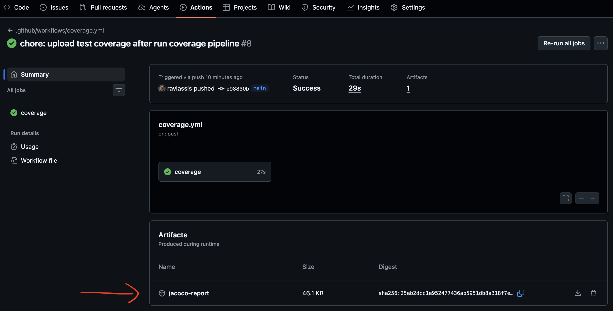

## Chosen Language
I chose Java because it can give me the performance and scalability that I need for this project. Also, Java is a mature, robust, well structure, high tested and high adopted language.

## Test Coverage Report
I configured test coverage report libs for each project (backend JaCoCo, front Jest).
They run automatically when open a PR or after any push in the main branch. 
### Where do I find the report?
It can be downloaded on the action's coverage page, after a successful pipeline execution

## Observability
I configured Protheus+Grafana for monitoring container metrics like cpu usage, memory usage, RPS, latency, etc. I also configured quarkus telemetry with Grafana Tempo to help me analyse end-to-end request traces, database query performance, to find the bottlenecks.

## Load tests
Before starts tunning the application performance, I created load tests scenarios using k6 to mesure the current application's performance. I expected to find insights of where should I improve the performe and compare the modifications
